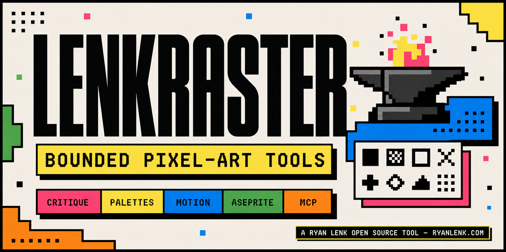
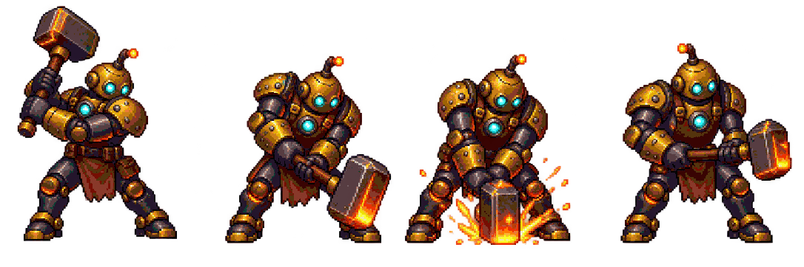
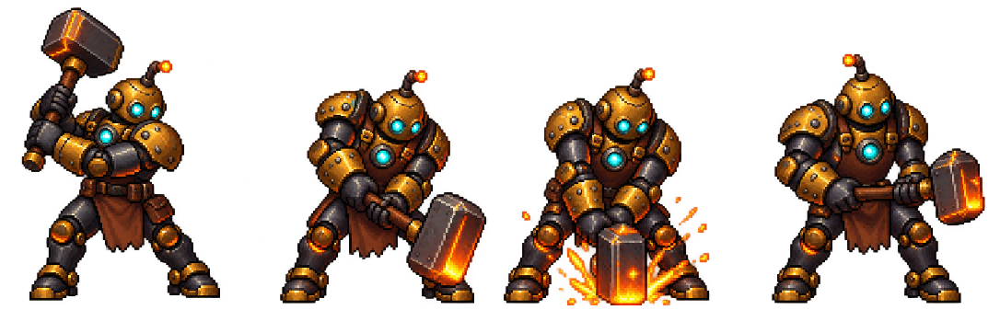

# LenkRaster



LenkRaster is a deterministic, bounded toolkit for inspecting and preparing pixel art.
It combines craft critique, palette operations, animation-cycle QA, an optional Aseprite
CLI bridge, a command-line interface, a Python API, and a trusted-local stdio MCP server.

LenkRaster is designed for agent workflows without turning an agent into an art director:
its reports are advisory evidence and retry hints. It does not approve artwork, replace
human review, or replace a project's composition, provenance, and release gates.

## What it does

- Scores bounded PNG sprites against explainable pixel-craft checks.
- Builds OKLCH hue-shifted material ramps.
- Quantizes PNGs against original built-ins or bounded user-owned palette JSON without
  overwriting existing files.
- Reports same-hue contrast and palette structure.
- Measures animation motion and visibility using rendered-pixel math.
- Exports and directly checks trusted local `.ase`/`.aseprite` documents through a
  separately installed Aseprite CLI.
- Exposes the same bounded operations to local MCP clients over stdio.
- Replays user-owned, SHA-256-pinned golden corpora without promoting results to approval.

No GPU, API key, model download, browser, network service, or persistent daemon is
required.

## See it in action

These are real outputs from the current LenkRaster CLI. The public source art and its
provenance are documented in
[docs/examples](https://github.com/itsryanlenk/lenkraster/blob/main/docs/examples/README.md).

### One fixed palette across an animation

Palette normalization is constraint enforcement for asset pipelines, not an attempt to
"improve" an artist's source image. This four-frame hammer cycle intentionally contains
frame-exclusive RGB variation. LenkRaster maps it to one repository-owned 48-color target
without changing the poses or overwriting the source.

| Source cycle | Fixed target | Verified output |
|---|---|---|
| 77,766 distinct visible RGB values | 48 user-owned colors | 48/48 used; every visible output color belongs to the target |



<details>
<summary>Inspect the unnormalized source strip</summary>



</details>

```console
lenkraster quantize docs/examples/hammer-cycle-source.png \
  --palette-file docs/examples/hammer-cycle-palette.json \
  --root <absolute-path-to-repository> \
  --out hammer-cycle-local-output.png
```

Use the same palette file and settings for separately stored frames. `cycle` measures
rendered-pixel motion and visibility; it does not claim to judge visual quality or prove
palette membership.

### Aseprite export and cycle QA

The same four poses were assembled into a tagged `hammer` animation and exercised through
the separately installed, SHA-256-pinned Aseprite CLI bridge:

| Validated export | Advisory cycle report |
|---|---|
| 4 frames; 543x724 each; 120 ms per frame | `PASS`; 3/3 adjacent transitions detected; no issues |

LenkRaster exported the horizontal sheet and sanitized metadata into a new directory, then
ran the cycle check from a separate transient export. The `.aseprite` working document is
not distributed in the package or public repository.

### Color construction

| Seven-stop OKLCH material ramp | Ordered 4x4 Bayer dither |
|---|---|
|  |  |

```console
lenkraster ramp --color "#FF6B35" --stops 7 --drift -10 \
  --out docs/examples/material-ramp.png
lenkraster dither --a "#2196F3" --b "#FFEB3B" --size 256 --order 4 \
  --out docs/examples/ordered-dither.png
```

These examples demonstrate deterministic transformations, not artwork approval; critique
and animation QA remain advisory evidence for human review.

## Security model

LenkRaster processes image files, so limits and containment are part of its public
contract:

- MCP file operations require an explicit, existing `LENKRASTER_TRUSTED_ROOT`.
- Resolved inputs and outputs must remain beneath that root; traversal and symlink escapes
  fail closed.
- PNG encoded bytes, decoded pixels, dimensions, frame discovery, frame count, total
  pixels, pair work, JSON size, and MCP request size are bounded.
- Quantized and Aseprite exports are create-only. Existing files and directories are never
  overwritten.
- Public errors are fixed messages and do not include local paths or subprocess output.
- The server is trusted-local stdio only. It is not a network service and must not be
  exposed as public HTTP.

The optional Aseprite bridge executes a native application and is not an operating-system
sandbox. Only process documents you trust. Use an OS sandbox for hostile or untrusted
Aseprite files.

See [SECURITY.md](https://github.com/itsryanlenk/lenkraster/blob/main/SECURITY.md) for
reporting and the maintained threat boundary.

## Requirements

- Python 3.10 or newer
- NumPy 2.x
- Pillow 12.3 or newer within the 12.x line
- Optional: Aseprite 1.3.17.2 or newer in the 1.3 line for `.ase`/`.aseprite`
  integration

Aseprite is not bundled, downloaded, or redistributed by LenkRaster. It is a separate
product with its own license. LenkRaster is compatible with its documented CLI and is not
affiliated with or endorsed by Aseprite.

## Install

From PyPI:

```console
python -m pip install lenkraster
```

The distribution and installed Python package are both `lenkraster`. The command-line
entry points are `lenkraster` and `lenkraster-mcp`.

From a checked-out source tree:

```console
python -m venv .venv
.venv/Scripts/python -m pip install --upgrade pip
.venv/Scripts/python -m pip install .
```

On macOS or Linux, use `.venv/bin/python` in place of
`.venv/Scripts/python`.

For development:

```console
python -m pip install -c requirements/ci.txt -e ".[dev]"
python -m pytest tests -q
python -m pip check
python -m pip_audit --skip-editable
```

## CLI

```console
lenkraster critique sprite.png
lenkraster critique sheet.png --json report.json
lenkraster ramp --color "#d77643" --stops 5 --drift -8 --out swatches.png
lenkraster dither --a "#ac530b" --b "#ffe0cc" --order 4 --out gradient.png
lenkraster check --file sprite.png
lenkraster quantize frame.png --palette lenk-studio-32 --out snapped.png
lenkraster quantize frame.png --palette-file palettes/my-palette.json \
  --root <absolute-path-to-sprite-workspace> --out snapped-custom.png
lenkraster palettes
lenkraster cycle "frame-*.png"
lenkraster shadow corpus/manifest.json --manifest-sha256 <sha256>
```

`cycle` returns exit code 0 for `PASS` and 1 for `REVIEW`. A review result is
not a release rejection unless your project has separately adopted that policy.

### User-owned palette files

`lenkraster palettes` lists the four original built-ins: `lenk-cinder-16`, `lenk-fern-4`,
`lenk-signal-16`, and `lenk-studio-32`. A user-owned palette is a UTF-8 JSON file below an
explicit trusted root:

| Built-in | Colors | Intended use |
|---|---:|---|
| `lenk-fern-4` | 4 | Compact moss-and-ink monochrome work |
| `lenk-cinder-16` | 16 | Warm industrial sprites and environment tiles |
| `lenk-signal-16` | 16 | High-contrast characters and UI accents |
| `lenk-studio-32` | 32 | General-purpose multi-material sprite work |

```json
{
  "name": "My fixed palette",
  "author": "Local user",
  "colors": ["102030", "f0e0d0"]
}
```

Palette files are limited to 16 KiB, 2-64 unique six-digit RGB colors, exact keys, and
bounded path-free metadata. MCP callers use `palette_file` relative to
`LENKRASTER_TRUSTED_ROOT`; CLI callers use `--palette-file` with `--root`.

Common 4-, 16-, and 32-color external palette workflows were exercised during
pre-publication compatibility testing. Users may place any lawfully obtained palette in
their own local JSON file and use the same `palette_file` interface. Users remain
responsible for the provenance and permitted use of supplied palettes.

### Optional Aseprite bridge

Set the executable to an absolute path:

```console
LENKRASTER_ASEPRITE_EXECUTABLE=<absolute-path-to-aseprite>
LENKRASTER_ASEPRITE_SHA256=<sha256-of-that-executable>
```

The SHA-256 pin is strongly recommended. LenkRaster checks it before the version probe
and again immediately before export, and rejects unsupported Aseprite versions. Recompute
the pin whenever Aseprite is intentionally updated.

Export a horizontal sheet and sanitized manifest into a directory that does not yet exist:

```console
lenkraster aseprite-export hero.aseprite \
  --root <absolute-path-to-sprite-workspace> \
  --out-dir exports/hero \
  --tag walk
```

For an output such as `exports/hero`, LenkRaster may create the one missing
immediate parent directory (`exports`) below the trusted root. It will not
recursively create a deeper missing directory tree; create any earlier directories
explicitly. The final output directory (`hero`) remains create-only.

Run cycle QA without retaining exported files:

```console
lenkraster aseprite-cycle hero.aseprite \
  --root <absolute-path-to-sprite-workspace> \
  --tag walk \
  --motion-threshold 12 \
  --min-motion-pixels 6
```

The bridge passes a fixed argument vector to Aseprite batch mode. Callers cannot supply
scripts, arbitrary flags, output filenames, or shell fragments. Tag and layer selections
are optional bounded labels; nested layers use `/` (for example,
`characters/hero body`) and Unicode names are supported. Each invocation uses a fresh
disposable Aseprite user/configuration folder and a snapshotted input document, so the
operator's normal Aseprite extensions and preferences are not loaded. Validated output is
written to a hidden staging directory and becomes visible with one final create-only
directory rename.

## MCP server

Any MCP-speaking client can launch the installed one-shot stdio server. Always use
absolute paths in the client configuration:

```json
{
  "mcpServers": {
    "lenkraster": {
      "command": "<absolute-path-to-venv>/Scripts/lenkraster-mcp.exe",
      "args": [],
      "env": {
        "LENKRASTER_TRUSTED_ROOT": "<absolute-path-to-disposable-sprite-workspace>",
        "LENKRASTER_ASEPRITE_EXECUTABLE": "<absolute-path-to-aseprite>",
        "LENKRASTER_ASEPRITE_SHA256": "<sha256-of-that-executable>"
      }
    }
  }
}
```

The Aseprite variables are optional when those tools are not used. The trusted-root
variable is required for every tool call. MCP clients cannot override the configured
executable or its SHA-256 pin.

LenkRaster exposes seven tools:

| Tool | Purpose |
|---|---|
| `critique_sprite` | Score one bounded PNG and return findings/retry hints. |
| `make_ramp` | Generate a bounded OKLCH material ramp. |
| `palette_quantize` | Create a new PNG using an original built-in or trusted user palette. |
| `contrast_report` | Report same-hue lightness separation. |
| `qa_cycle` | Check 2-32 same-size PNG frames matched by a relative glob. |
| `aseprite_export` | Create a validated sheet and path-free manifest. |
| `qa_aseprite_cycle` | Export transiently and run bounded cycle QA. |

Project-specific adapters and private art corpora are intentionally outside the MCP
surface and the distribution.

## Python API

```python
from lenkraster import (
    critique,
    export_aseprite_document,
    load_palette_file,
    make_ramp,
    qa_aseprite_document,
    qa_cycle,
    quantize_file,
)

report = critique("sprite.png")
print(report["score"], report["retry_hints"])

ramp = make_ramp("#d77643", stops=5, drift=-8.0)
quantize_file("frame.png", "lenk-studio-32", "snapped.png")
load_palette_file("palettes/my-palette.json", trusted_root="sprite-workspace")
quantize_file(
    "frame.png",
    None,
    "snapped-custom.png",
    palette_file="palettes/my-palette.json",
    palette_root="sprite-workspace",
)

motion = qa_cycle(
    ["base.png", "frame-1.png", "frame-2.png"],
    roi=(12, 8, 44, 40),
    transition_groups={"walk": [(0, 1), (1, 2)]},
)

export_manifest = export_aseprite_document(
    "hero.aseprite",
    "exports/hero",
    trusted_root="sprite-workspace",
)

aseprite_motion = qa_aseprite_document(
    "hero.aseprite",
    trusted_root="sprite-workspace",
    tag="walk",
)
```

For the Aseprite Python API, configure `LENKRASTER_ASEPRITE_EXECUTABLE` or pass an
absolute executable path through the trusted local API. MCP clients cannot choose the
executable.

## Design laws

- **Rendered-pixel law:** RGB beneath fully transparent pixels does not affect critique,
  contrast, quantization, or motion.
- **Shared-palette law:** animation frames should use the same fixed target palette and
  settings.
- **Motion-group law:** every authored gesture group must independently contain a
  qualifying transition.
- **Vision-is-not-QA law:** animation correctness is computed from pixels, not inferred
  from thumbnails.
- **Bounded-work law:** encoded bytes, decoded pixels, frames, discovery, and comparisons
  fail closed at explicit ceilings.
- **Advisory law:** LenkRaster produces evidence and retry hints, never art approval.

## Golden-corpus regression

`lenkraster shadow` accepts a bounded, caller-hash-pinned manifest containing
user-owned PNG fixtures. Automated cases report `BASELINE_MATCH` or `DRIFT`;
contextual cases remain `HUMAN_REVIEW`. Do not commit proprietary or private artwork to
this public repository.

## Development and release

Contributions are welcome; read
[CONTRIBUTING.md](https://github.com/itsryanlenk/lenkraster/blob/main/CONTRIBUTING.md).
Public artifact checks
and release provenance steps are documented in
[docs/release-checklist.md](https://github.com/itsryanlenk/lenkraster/blob/main/docs/release-checklist.md).

The source and repository-authored assets are MIT licensed. See
[ASSET_LICENSE.md](https://github.com/itsryanlenk/lenkraster/blob/main/ASSET_LICENSE.md)
for palette and image scope, and
[THIRD_PARTY_NOTICES.md](https://github.com/itsryanlenk/lenkraster/blob/main/THIRD_PARTY_NOTICES.md)
for dependency, method, and optional-tool notices. User-supplied palettes and Aseprite
itself are not part of this distribution.
